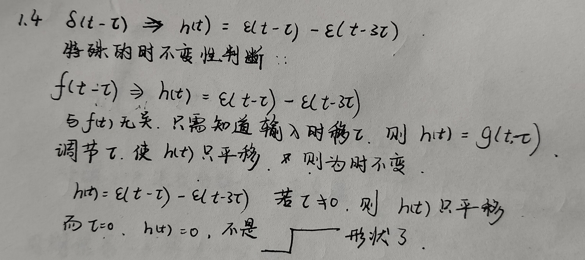

#### 第一章：

细节：
(1)知识点：信号是信息的载体。系统是对信号进行加工与变换的电路。
(2)y(t)=af(t)+b是不是线性系统是有争议的。直觉上认为其是，通过定义则认为不是，还有的书籍认为其是带增量的线性系统。具体的应该看目标院校对其的定义。
(3)系统特性的证明与判断：
1. 线性
    需要证明齐次性:$af(t)=>ay(t)$与叠加性:$af_1(t)+bf_2(t)=>ay_1(t)+by_2(t)$
    <b>注意：其中f(t)的操作重点在于f，即只对f进行操作，y(t)的重点在于t,即对自变量进行操作。</b>
例：$y(t)=costf(t)$证明齐次型
$$
af(t)=>costf(t)=acostf(t)=ay(t)
$$
(可以看到齐次型重点在与a能否被当作公因式提出，且是对f进行操作，将cost视为常数)
2. 时不变性$f(t-t_0)=>y(t-t_0)$
例：y(t)=f(2t)
$$
f(t-t_0)=>f(2t-t_0)\neq f(2t-2t_0)=y(t-t_0)
$$
(可以发现上面提到的对f与y(t)的操作在时不变性的证明中体现的淋漓尽致，f是将自变量时为一个整体，y(t)则注重t的变化)
例：$y(t)=costf(t)$
$$
f(t-t_0)=>costf(t-t_0)\neq cos(t-t_0)f(t-t_0)=y(t-t_0)
$$
3. 因果性：
利用系统函数，若系统函数的极点均在收敛线左侧，即Re[极点]<$\sigma _0$
4. 稳定性：
若所有的Re[极点]<0，则系统一定为稳定因果系统

(4)周期信号之和不一定为周期信号
若要其和为周期信号，要求所有的周期之比为有理数
(5)分数的最小公倍数
两者相比，并交叉相乘
$$
\frac{\frac{1}{12}}{\frac{1}{4}}=\frac{1}{3}\\
3*\frac{1}{12}=1*\frac{1}{4}=\frac{1}{4}\\
最小公倍数为\frac{1}{4}
$$
(5)$f(t)\delta'(t)=-[f'(0)\delta(t)-f(0)\delta'(t)]$
(6)cos与sin的平均功率为系数的平方除以2
例如
$$
a_0cosw_0t+a_1cosw_1t+b_0sinw_2t+b_1sinw_3t的平均功率为\\
\frac{a_0^2+a_1^2+b_0^2+b_1^2}{2}
$$
(7)特殊的时不变性处理

#### 第二章

#### 第三章

细节：
(1)傅里叶变换不改变函数的奇偶性

#### 第四章

细节：
(1)双边拉普拉斯变换的公式与单边拉普拉斯公式相同

#### 傅里叶变换与单边拉普拉斯变换的总结

