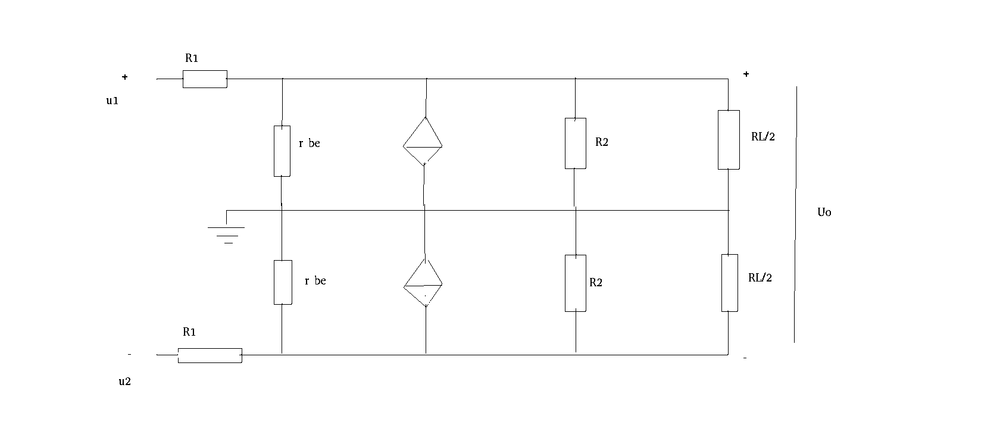
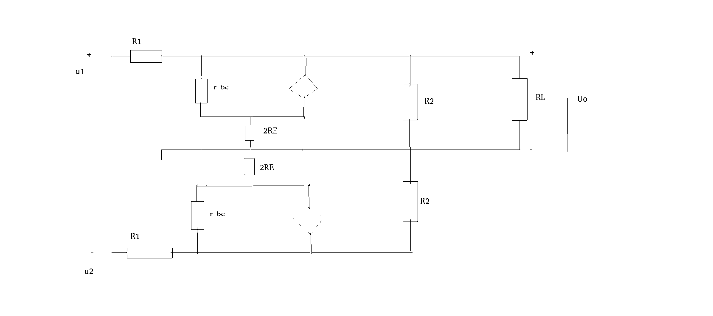
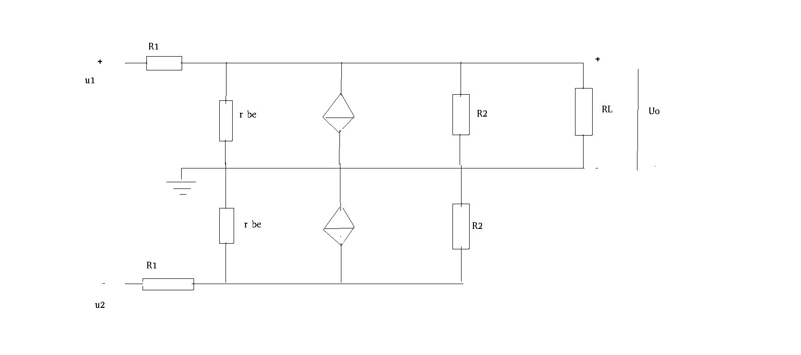

# 本章的内容较多，且考试会考到，处理方法并不常见，还需要记住一些概念
## 零点漂移(温漂)
零点漂移：指输入电压为0时，输出电压发生缓慢的、无规则的变化的现象。

产生原因：晶体管参数随温度变化、电源电压的波动、电路元件参数的变化。

差分放大电路是抑制零点漂移的最有效的电路结构。
## 差分放大电路

1. 静态分析
$$
I_BR_B+U_{BE}+2I_ER_E=V_{EE}
$$
如果进行省略，则
$$
I_C\approx I_E=\frac{V_{EE}}{2R_E}
$$
$$
I_B=\frac{I_C}{\beta}
$$
$$
U_{CE}=U_{CC}-I_CR_C
$$
可以发现
$$
V_E\approx 0
$$
2. 动态分析
    1. 信号拆分
    共模信号
    $$
    U_c=\frac{u_1+u_2}{2}
    $$
    差模信号
    $$
    U_d=\frac{u_1-u_2}{2}
    $$
    则
    $$
    u_1=U_c+U_d,\ \ \ u_2=U_c-U_d
    $$
    则u1与u2均可以分别分成两个信号
    2. 双输入双输出电路分析
    对于共模信号，因为对称性，其输出信号为0,即放大倍数为0。
    对于差模信号因为两边电路相同，可以对其中的一半进行分析
    
    $$
    A_d=-\frac{\beta (R_2//\frac{R_L}{2})}{R_1+r_{be}}
    $$
    $$
    r_o=2R_2
    $$
    $$
    r_i=2(R_1+r_{be})
    $$
    3. 双输入单输出电路分析
    对于共模信号
    
    $$
    A_c=-\frac{\beta (R_2//R_L)}{R_1+r_{be}+2(1+\beta )R_E}
    $$
    $$
    r_i=R_1+r_{be}+2(1+\beta )R_E
    $$
    $$
    r_o=R_2
    $$
    对于差模信号
    
    $$
    A_d=\frac{U_o}{U_i}=-\frac{\beta (R_L//R_2)}{2(R_1+r_{be})}
    $$
    $$
    r_i=2(R_1+r_{be})
    $$
    $$
    r_o=R_2
    $$
    4. 单输入双输出电路
    
    可以认为单输入电路是u2=0的特殊双输入电路，故分析与双输入电路相同。
3. 共模抑制比
$$
u_o=A_cu_{Ic}+A_du_{Id}
$$
即输出电压由两部分组成，在使用时我们希望减少A_c，故定义共模抑制比
$$
K_{CMRR}=\frac{A_d}{A_c}
$$
$$
K_{CMR}(dB)=20lg(\frac{A_d}{A_c})
$$